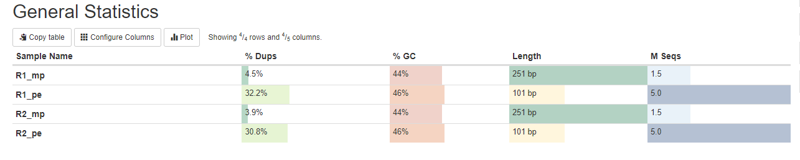
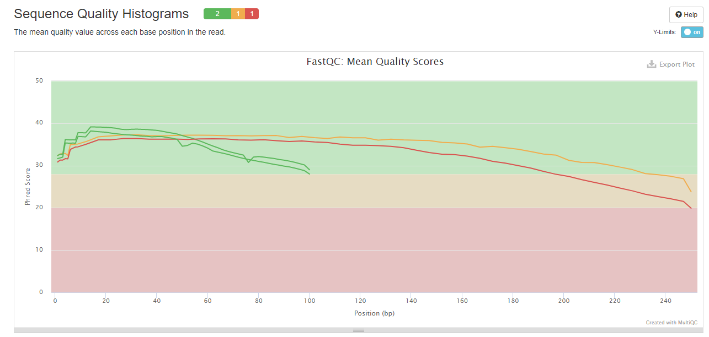
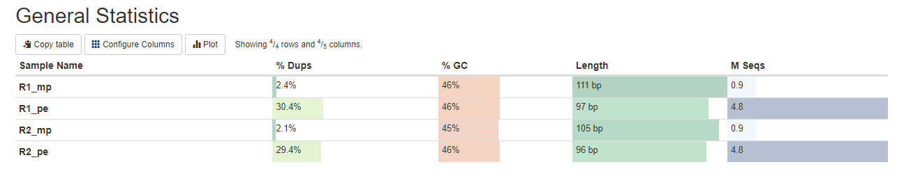
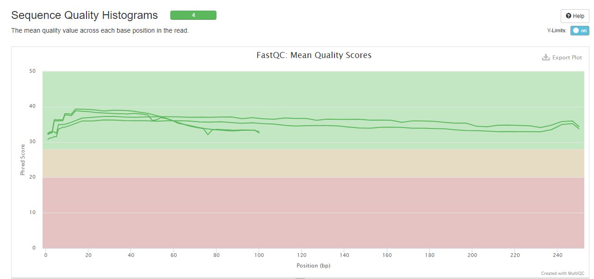

# hse21_hw1
### HW1
1. Символические ссылки на каждый из файлов
```
 ls /usr/share/data-minor-bioinf/assembly/* | xargs -tI{} ln -s {}
```

2. Выбираем случайные чтения
```
seqtk sample -s203 oil_R1.fastq 5000000 > R1_pe.fastq
seqtk sample -s203 oil_R2.fastq 5000000 > R2_pe.fastq
seqtk sample -s203 oilMP_S4_L001_R1_001.fastq 1500000 > R1_mp.fastq
seqtk sample -s203 oilMP_S4_L001_R2_001.fastq 1500000 > R2_mp.fastq
```
```
mkdir randR
mv R1_pe.fastq randR
mv R2_pe.fastq randR
mv R1_mp.fastq randR
mv R2_mp.fastq randR
```
```
cd randR
```

3. fastqc, multiqc
```
mkdir fastqc
ls *.fastq | xargs -P 4 -tI{} fastqc -o fastqc {}
mkdir multiqc
multiqc -o multiqc fastqc
```
 


4. Подрезание чтений по качеству и удаление праймеры
```
platanus_trim R1_pe.fastq  R2_pe.fastq
platanus_internal_trim R1_mp.fastq R2_mp.fastq
```
```
mv -v *trimmed trimmed_fastq
mv -v *.fastq fastq
```

5. fastqc, multiqc
```
mkdir trimmed_fastqc
trimmed_fastq/* | xargs -P 4 -tI{} fastqc -o trimmed_fastqc {}
mkdir trimmed_multiqc
multiqc -o trimmed_multiqc trimmed_fastqc
```

 


6. platanus assemble
```
time platanus assemble -o Poil -t 1 -m 16 -f trimmed_fastq/R1_pe.fastq.trimmed  trimmed_fastq/R2_pe.fastq.trimmed 2>assemble.log
```

7. Код на python (общее количество = 613, общая длина = 3925593, длина самого длинного = 179307, N50 = 24464)

https://github.com/LittlePolly/hse21_hw1/blob/main/src/pvzelina_hw1.ipynb

8. platanus scaffold
```
time platanus scaffold -o Poil -t 1 -c Poil_contig.fa -IP1 trimmed_fastq/R1_pe.fastq.trimmed trimmed_fastq/R2_pe.fastq.trimmed
-OP2 trimmed_fastq/R1_mp.fastq.int_trimmed trimmed_fastq/R2_mp.fastq.int_trimmed 2> scaffold.log
```
9. Код на Python (общее количество = 69, общая длина = 3876617, длина самого длинного = 3838446, N50 = 3838446)

https://github.com/LittlePolly/hse21_hw1/blob/main/src/pvzelina_hw1.ipynb

10. Анализ самого длинного scaffold (количество gap = 64, общая длина = 7326)

```
echo scaffold1_len3838446_cov232 > _tmp.txt
seqtk subseq Poil_scaffold.fa _tmp.txt > scaffold1_len3838446_cov232.fasta
```
```
grep -o 'N\+' scaffold1_len3838446_cov232.fasta | wc -l
grep -o 'N' scaffold1_len3838446_cov232.fasta | wc -l
```

11. platanus gap close (количество gap = ,8 общая длина = 2294)
```
time platanus gap_close -o Poil -t 1 -c Poil_scaffold.fa -IP1 trimmed_fastq/R1_pe.fastq.trimmed trimmed_fastq/R2_pe.fastq.trimmed 
-OP2 trimmed_fastq/R1_mp.fastq.int_trimmed trimmed_fastq/R2_mp.fastq.int_trimmed 2> gapclose.log
```

```
echo scaffold1_cov232 > _tmp2.txt
seqtk subseq Poil_gapClosed.fa _tmp2.txt > longest.fasta
```
```
grep -o 'N\+' longest.fasta | wc -l
grep -o 'N' longest.fasta | wc -l
```
